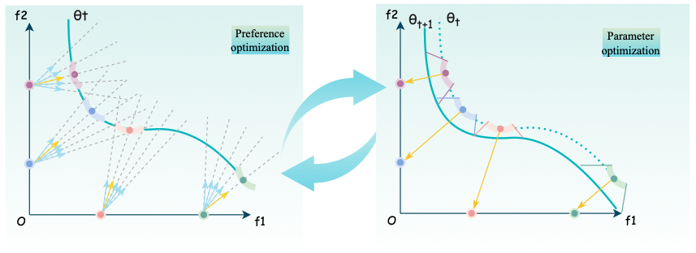

# Preference-Optimized Pareto Set Learning for Blackbox Optimization (PO-PSL)





**Preference-Optimized Pareto Set Learning for Blackbox Optimization (PO-PSL)**


## Overview

This repository contains the official PyTorch implementation of the algorithm framework for PO-PSL.

## Introduction

Multi-Objective Optimization (MOO) is an important problem in real-world applications. However, for a non-trivial
problem, no single solution exists that can optimize all the objectives simultaneously. In a typical MOO problem, the goal
is to find a set of optimum solutions (Pareto set) that trades off the preferences among objectives. Scalarization in MOO is a
well-established method for finding a finite set approximation of the whole Pareto set (PS). However, in real-world experimental design scenarios, it’s beneficial to obtain the whole PS for flexible exploration of the design space. Recently
Pareto set learning (PSL) has been introduced to approximate the whole PS. PSL involves creating a manifold representing the Pareto front of a multi-objective optimization problem. A naive approach includes finding discrete points
on the Pareto front through randomly generated preference vectors and connecting them by regression. However, this approach is computationally expensive and leads to a poor PS approximation. We propose to optimize the preference points
to be distributed evenly on the Pareto front. Our formulation leads to a bilevel optimization problem that can be solved by
e.g. differentiable cross-entropy methods. We demonstrated the efficacy of our method for high-dimensional and difficult black-box MOO problems using both synthetic and realworld benchmark data.


## Key Features

- **Model and Algorithm**: We formulated the PSL problem as a bi-level optimization problem using preference optimization-based modeling. See *net/model.py* and *dcem/dcem_bm.py*. The DCEM part is referenced from [The Differentiable Cross-Entropy Method](https://github.com/facebookresearch/dcem).
- **Train and Optimization**: The learning-based optimization algorithm can learn the entire Pareto font while optimizing the preference vector in an end-to-end fashion. See *train.py*.
- **Problems**: Support: ZDT3, DTLZ2, DTLZ5, RE5 and and custom problems. See *net/problem.py* to select proper problem to use / define your own problem.
- **Surrogate model**: Support Gaussian process as surrogate model to evaluate samples. See *net/model.py*.
- **Penalty item**: We add a penalty item for the loss function. See *train.py*.

For PO-PSL, we use PBI as acquisition function.

## Code Structure

```
config/ --- The Config file for hyperparameter.
data/ --- The ground truth data we use for evaluation.
dcem/ --- The dcem algorithm for preference optimization.
net/
 ├── model.py --- The model file for PO-PSL.
 └── problem.py --- Problem defination file.
visualization/ --- performance visualization.
train.py --- main execution file for PO-PSL.
```

## Requirements

- Python version: tested in Python 3.8.7

- Operating system: tested in Ubuntu 18.04.5 LTS

- Install the environment by pip and activate:

  ```
  python -m venv popsl
  source popsl/bin/activate
  pip install -r requirements.txt
  ```


## Getting Started

### Basic usage

Run the train file with python with specified arguments:

```
python train.py train.problem='re5' train.save_path='result' train.num_bs=10 train.batch_size=8 model.rho=5 model.lamda=1
```

If you don't understand the meaning of the arguments, please see *config/config.py*.

## Result

The optimization results are saved in csv format and the arguments are saved as a yaml file. They are stored under the folder:

```
result-{problem}/
```

Then, under that folder, the name of csv files would be:

```
y-{n_iteration}-{n_run}.csv
```

The name of the argument yaml file is `mo_train.yml`.

*Explanation --- problem: problem name, n_iteration: iteration ID, n_run: experiment ID*


## Custom Problem Setup

If you are interested in trying PO-PSL for your own problems, here are the necessary steps:

- First, to define your custom problem, here is a basic template to write in `net/problem.py`. 

```python
class Custom():
    def __init__(self, n_dim=1, n_obj=1):
        '''
        provide the dimension of variable and objective
        '''
        self.n_dim = n_dim
        self.n_obj = n_obj
        self.lbound = torch.zeros(n_dim).float()
        self.ubound = torch.ones(n_dim).float()

    def evaluate(self, x):
        '''
        set your problem here and returh the objectives
        return: objs -[n_samples, n_obj]
        '''

        return 
```

For more examples of predefined optimization problems, please refer to `net/problem.py`.

## Citation

If you find our repository helpful to your research, please cite our paper:

...